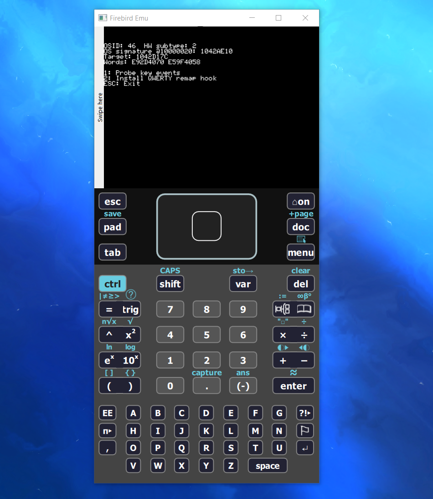

# TI-Nspire CX II Custom Keyboard Remap

<p align="center">
  
</p>

<p align="center">
  
</p>

<p align="center">
  
  
  
  
</p>

This project adds a QWERTY-style alphabet remap for the TI-Nspire CX II CAS.
It is built as a small Ndless app that rewrites alphabetic key events before
the OS delivers them to the active input field.

## The Problem

The stock alpha layout is alphabetical by key position, which makes typing
commands, variable names, and longer text slower if you are used to a normal
keyboard. The goal was to keep the physical calculator keys as-is while making
the output feel closer to QWERTY.

## The Fix

The app installs a resident hook on the OS event queue for TI-Nspire CX II CAS
OS `6.2.0.333`. When an A-Z key event comes through, the hook swaps the ASCII
letter to the QWERTY-style output letter and leaves non-letter keys alone.

The program also includes a probe mode that prints `source -> mapped` rows, so
the mapping can be checked directly on the calculator screen before installing
the remap.

## Layout

```text
Physical alpha layout        Custom output layout
A B C D E F G       ->      Q W E R T Y U
H I J K L M N       ->      A S D F G H J
O P Q R S T U       ->      K L Z X C V B
V W X Y Z           ->      N M P O I
```

## How It Works

- `qwerty_map_char()` contains the A-Z remap table.
- `rewrite_key_event()` edits alphabetic OS key events in place.
- `HOOK_INSTALL()` attaches the remap to `send_to_event_queue`.
- The install path checks the OS ID, OS signature, and function fingerprint for
  the CX II CAS OS `6.2.0.333` target before installing.

## Build

Install the Ndless SDK and make sure these tools are on `PATH`:

```text
nspire-gcc
nspire-ld
genzehn
make-prg
```

Then build:

```sh
cd src
make clean all
```

The output is created at:

```text
src/build/qwerty_keymap.tns
```

## Files

- `src/qwerty_keymap.c`: remap logic and install menu.
- `src/Makefile`: Ndless build.
- `assets/fast-calculator.gif`: calculator demo.
- `assets/terminal-calc.png`: terminal screenshot.
